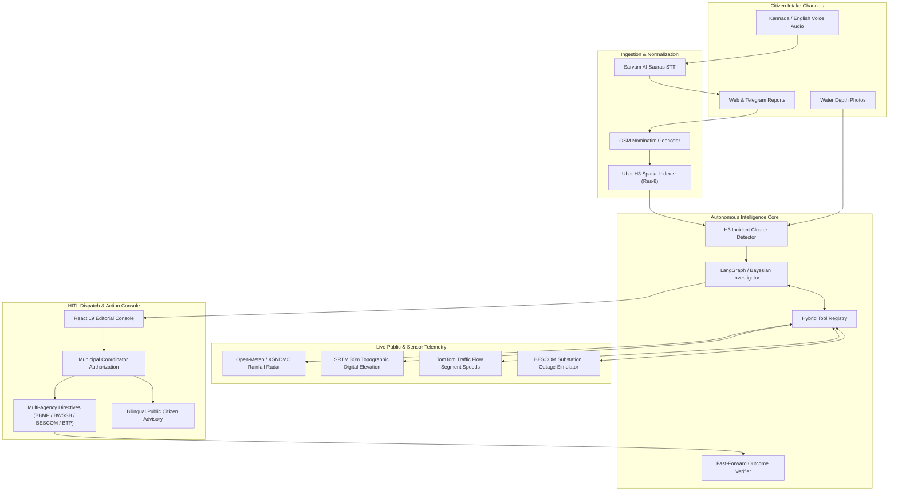

# CrossWire (NammaTwin)

> **Autonomous Multi-Agency Urban Incident Intelligence & Spatial Root-Cause Diagnosis Platform for Bengaluru**

[](https://www.python.org/)
[](https://fastapi.tiangolo.com/)
[](https://react.dev/)
[](https://www.typescriptlang.org/)
[](https://vitejs.dev/)
[](https://tailwindcss.com/)
[](https://gsap.com/)
[](https://leafletjs.com/)
[](https://h3geo.org/)

---

## 🏛️ Executive Summary

When heavy monsoons or sudden utility failures hit Bengaluru, urban flooding is rarely an isolated event. It is a cascading systemic failure spanning multiple municipal jurisdictions:

* **BBMP (Stormwater Drains & Roads):** Manages primary storm canals (*Rajakaluves*) and surface road drainage.
* **BWSSB (Water Supply & Sewerage):** Operates underground pressurized drinking water mains and Sewage Treatment Plants (STPs).
* **BESCOM (Electricity Supply):** Powers sewage wet-well pumps and street infrastructure via 11kV feeder lines.
* **Bangalore Traffic Police (BTP):** Manages arterial bottlenecks along critical IT corridors like the Outer Ring Road (ORR).

Traditionally, citizens log isolated complaints on siloed department hotlines. Field teams respond blind, treating symptoms rather than root causes—such as pumping water away from an underpass while an upstream electrical feeder trip or ruptured municipal main continues flooding the basin unchecked.

**CrossWire** bridges this divide. It ingests multimodal citizen reports (Kannada/English voice notes, photos with depth tagging, pinned coordinates), clusters them using Uber H3 spatial hexagons, autonomously correlates live public environmental signals (radar rainfall, 30m digital elevation, electrical grid logs, live TomTom traffic flow), computes Bayesian root-cause probabilities with humanized plain-English diagnoses, and empowers municipal coordinators with a **Human-In-The-Loop (HITL)** dispatch desk to issue coordinated multi-agency directives.

---

## 🔄 4-Stage Operational Protocol

CrossWire follows an editorial minimalist workflow designed for rapid high-stress incident command:

```
┌────────────────────────┐      ┌────────────────────────┐
│  STAGE 1: INTAKE       │ ───► │  STAGE 2: CARTOGRAPHY  │
│  Multimodal Complaints │      │  H3 Spatial Twin & Basins│
└────────────────────────┘      └────────────────────────┘
            │                               │
            ▼                               ▼
┌────────────────────────┐      ┌────────────────────────┐
│  STAGE 3: DIAGNOSIS    │ ───► │  STAGE 4: DISPATCH     │
│  Bayesian Root-Cause   │      │  HITL Multi-Agency Plan │
└────────────────────────┘      └────────────────────────┘
```

### 1. Stage 1: Multimodal Citizen Intake & Ingestion
* **Sarvam AI Saaras STT:** Native Kannada speech-to-text with auto-translation to English and intent extraction.
* **Leaflet Mini-Map Pin Picker:** Interactive coordinate selector equipped with a `ResizeObserver` lifecycle and multi-interval size invalidation to ensure zero render glitches inside modal views.
* **OpenStreetMap Nominatim Geocoding:** Instant lookup for Bengaluru landmarks (*Bellandur EcoSpace, Silk Board, Kadubeesanahalli, Hebbal, etc.*) with H3 index resolution.
* **Physical Depth Calibration:** Structured water-depth tagging (*Ankle, Knee, Waist, Vehicle Submerged*) with camera photo uploads.
* **Clean Slate / Reset (`/system/reset`):** Instant blank canvas reset to test real-world scenarios from scratch without stale test fixtures.

### 2. Stage 2: Geographic Digital Twin & Cartography
* **Swiss Architectural Monochrome Map:** Built on OpenStreetMap with zero external API key watermarks, high-contrast typography, and strict paint containment (`contain: paint`).
* **H3 Res-8 Hexagonal Cells:** Dynamic spatial clustering that binds fragmented complaints into unified incident zones.
* **Hydrological Vectors:** Visualizes primary *Rajakaluve* stormwater paths, low-lying drainage depression basins, and lake overflow lines.
* **Critical Infrastructure Points of Interest:** Live tracking of nearby hospitals, schools, BESCOM electrical substations, and BWSSB STPs.
* **Live Arterial Traffic Congestion:** Correlated corridor speeds powered by the TomTom Traffic Flow API.

### 3. Stage 3: Autonomous Root-Cause Diagnosis
CrossWire evaluates 6 distinct urban failure hypotheses using Bayesian probability ranking and plain-English narrative explainability:

| Hypothesis Code | Diagnostic Label | Responsible Agencies |
| :--- | :--- | :--- |
| `POWER_LED_STP_OVERFLOW` | Substation feeder trip halts sewage pumps, creating a 45-min holding lag before basin overflow | BESCOM + BWSSB |
| `PIPE_BURST` | Pressurized underground water main rupture occurring during zero-rain conditions | BWSSB Water Supply |
| `DRAIN_BLOCKAGE` | Silt accumulation and solid waste obstructing stormwater culvert discharge | BBMP SWD + Solid Waste |
| `RAIN_OVERWHELM` | Inflow precipitation exceeding canal maximum volumetric capacity | BBMP Disaster Mgmt |
| `LAKE_OVERFLOW` | Lake weir overtopping resulting in upstream reverse-backflow flooding | Lake Authority / BBMP |
| `TRAFFIC_ONLY` | Heavy bottleneck congestion without surface water accumulation | Traffic Police (BTP) |

* **Humanized Plain-English Narrative:** Replaces raw probabilistic formulas with step-by-step causal timelines (*e.g., "1. Zero Rain Detected → 2. Topographic Depression → 3. Ruptured Feeder Valve"*).
* **GSAP-Powered Telemetry Bars:** Hardware-accelerated probability visualizations with live radar rainfall, SRTM 30m elevation depression bowls, and speed ratios.

### 4. Stage 4: Human-In-The-Loop (HITL) Dispatch Console
* **Multi-Agency Action Plan:** Concrete, targeted action directives formulated for each specific department:
  * **BWSSB:** Deploy heavy dewatering suction pumps, isolate upstream pressure valves, start backup diesel generators.
  * **BESCOM:** Inspect 11kV substation breakers, reroute power feeds to critical sewage pumping stations.
  * **BBMP SWD:** Deploy emergency earthmovers and desilting gangs to clear clogged culvert screens.
  * **Traffic Police (BTP):** Close flooded underpasses, deploy tow cranes, and activate arterial diversions.
* **Official Bilingual Public Advisory:** Instant English & Kannada advisories ready for broadcast to citizens and commuters.
* **Municipal Authorization:** One-click coordinator approval with immutable audit logs and outbox dispatch records (`data/outbox.jsonl`).

---

## 🏗️ System Architecture



---

## 📁 Repository Structure

```text
CrossWire/
├── app/                           # Backend FastAPI & Core Intelligence Engine
│   ├── api/                       # API routes (tickets, incidents, audio, geocode, system)
│   │   ├── main.py                # FastAPI factory, endpoints & middleware
│   │   └── schemas.py             # Pydantic v2 request/response schemas
│   ├── cluster/                   # Spatial clustering engine
│   │   └── detector.py            # H3-based ticket clustering & incident detection
│   ├── contracts/                 # Interfaces, data classes & domain models
│   │   ├── interfaces.py          # Abstract repositories, notifiers & detectors
│   │   └── models.py              # Ticket, Incident, Evidence, Decision models
│   ├── geo/                       # Geospatial utilities
│   │   ├── geocode.py             # OSM Nominatim geocoding & fallback resolver
│   │   └── h3_utils.py            # Lat/Lon to Uber H3 Res-8 converter
│   ├── intake/                    # Multimodal intake processing
│   │   ├── stt.py                 # Sarvam AI Saaras STT client
│   │   └── telegram_bot.py        # Telegram bot complaint ingestion
│   ├── investigator/              # Bayesian cause investigation graph
│   │   ├── hypotheses.py          # The 6 urban failure hypotheses definitions
│   │   ├── scoring.py             # Evidence scoring & Bayesian probability updates
│   │   └── run.py                 # Investigator runner & tool dispatch
│   ├── orchestrator/              # End-to-end pipeline execution
│   │   └── pipeline.py            # State coordinator, SQLite checkpointer & trace store
│   ├── planner/                   # Action generation & department routing
│   │   └── planner.py             # Multi-agency action planner & directive compiler
│   ├── tools/                     # Environmental sensor & telemetry tools
│   │   ├── elevation.py           # SRTM 30m topographic elevation queries
│   │   ├── rainfall.py            # Open-Meteo & KSNDMC precipitation radar
│   │   ├── traffic.py             # TomTom traffic flow speed ratio calculations
│   │   ├── outage_sim.py          # BESCOM electrical feeder trip simulator
│   │   └── _registry.py           # Auto-discovery tool registry
│   └── verifier/                  # Closed-loop outcome verification
│       └── verifier.py            # Post-dispatch verification engine
├── frontend/                      # Modern React 19 Frontend Dashboard
│   ├── src/
│   │   ├── api/client.ts          # Type-safe API client for FastAPI backend
│   │   ├── components/
│   │   │   ├── cause/             # Stage 3: CauseAnalysis with GSAP probability bars
│   │   │   ├── dispatch/          # Stage 4: DispatchConsole with HITL authorization
│   │   │   ├── intake/            # IntakeModal with Sarvam STT & Leaflet mini-map
│   │   │   ├── map/               # Stage 2: CityFloodMap with H3 hexagons & canals
│   │   │   ├── nav/               # HeaderNav with Clean Slate Reset button
│   │   │   └── reports/           # Stage 1: CitizenReports bento grid & photo viewer
│   │   ├── styles/index.css       # Tailwind CSS & Leaflet map container styling
│   │   ├── types/api.ts           # Frontend TypeScript contract interfaces
│   │   ├── App.tsx                # Master state coordinator & stage switcher
│   │   └── main.tsx               # Entry point with Leaflet style imports
│   ├── package.json               # Frontend dependencies & build scripts
│   └── vite.config.ts             # Vite proxy configuration to backend API
├── data/                          # Data persistence & caches
│   ├── cache/                     # Cached rainfall, elevation, geocoding & STT fixtures
│   └── outbox.jsonl               # Immutable dispatch directive audit log
├── tests/                         # Pytest test suite (100+ unit & integration tests)
│   ├── P0/                        # Critical path sanity tests
│   └── fixtures/                  # Ground-truth scenario test cases
├── Makefile                       # Developer shortcuts (test, run-api, dev-frontend)
├── requirements.txt               # Backend Python dependencies
└── pyproject.toml                 # Project metadata & tool configurations
```

---

## 🚀 Quick Start Guide

### Prerequisites
* **Python:** 3.10, 3.11, or 3.12
* **Node.js:** v18.0.0 or higher (v20+ recommended)
* **npm:** v9.0.0 or higher

---

### 1. Backend Setup

```bash
# 1. Clone repository
git clone https://github.com/Nilayansh/CrossWire.git
cd CrossWire

# 2. Create and activate a virtual environment
python -m venv .venv

# On Linux / macOS:
source .venv/bin/activate
# On Windows (PowerShell):
.venv\Scripts\Activate.ps1

# 3. Install Python dependencies
pip install -r requirements.txt

# 4. Configure environment variables
cp .env.example .env
```

*(Optional)* Configure API keys in `.env` for live external services:
```env
DEMO_MODE=1
LLM_BACKEND=framework
OPENAI_API_KEY=your_openai_key_here
SARVAM_API_KEY=your_sarvam_key_here
TOMTOM_API_KEY=your_tomtom_key_here
```
> **Note:** CrossWire includes built-in offline caches and simulators for rainfall, elevation, geocoding, and audio transcription, allowing the system to run out-of-the-box in demo mode without requiring paid API keys.

---

### 2. Frontend Setup

```bash
# Navigate to the frontend directory
cd frontend

# Install Node dependencies
npm install

# Return to root
cd ..
```

---

### 3. Running the Application

You can start both backend and frontend using the provided `Makefile` or manual commands:

#### Terminal 1: Backend API (FastAPI)
```bash
make run-api
# Or directly:
python -m uvicorn app.api.main:app --host 0.0.0.0 --port 8000 --reload
```
* API Server: `http://localhost:8000`
* Interactive OpenAPI Docs: `http://localhost:8000/docs`

#### Terminal 2: Frontend Dashboard (Vite + React)
```bash
make dev-frontend
# Or directly:
cd frontend && npm run dev
```
* Dashboard URL: `http://localhost:5173`

---

## 🧪 Testing & Verification

CrossWire maintains a comprehensive test suite covering spatial clustering, Bayesian graph scoring, telemetry integrations, and API routes.

```bash
# Run the complete test suite
make test
# (Runs: python -m pytest tests -q)

# Run P0 critical path tests
make test-p0
# (Runs: python -m pytest tests/P0 -v)

# Verify frontend TypeScript compilation and production build
make build-frontend
# (Runs: cd frontend && npm run build)
```

---

## 📡 Core API Reference

| Method | Endpoint | Description |
| :--- | :--- | :--- |
| `GET` | `/health` | Service health status and readiness check. |
| `POST` | `/system/reset` | Clears all active incidents, tickets, evidence, and pipeline state. |
| `POST` | `/tickets` | Ingests a citizen ticket, resolves H3 cell, and triggers incident clustering. |
| `GET` | `/incidents` | Lists all active open incidents. |
| `GET` | `/incidents/{id}` | Fetches full incident dossier, ranked hypotheses, and generated action plans. |
| `GET` | `/incidents/{id}/stream` | Server-Sent Events (SSE) stream for live diagnostic investigation traces. |
| `POST` | `/incidents/{id}/decision` | Submits Human-In-The-Loop municipal coordinator approval for action directives. |
| `POST` | `/incidents/{id}/verify` | Simulates post-dispatch telemetry verification and status transitions. |
| `POST` | `/scenarios/load` | Ingests curated scenario fixtures (*e.g., `bellandur_flood`*). |
| `POST` | `/intake/audio` | Transcribes Kannada/English voice notes via Sarvam STT and extracts categories. |
| `GET` | `/intake/geocode` | Geocodes location text to coordinates and H3 cell via OSM Nominatim. |
| `GET` | `/traffic/flow` | Fetches live TomTom arterial segment traffic speeds and congestion ratios. |

---

## 📝 Recent Improvements & Changelog

* **Leaflet Mini-Map Stability (`7371e98`):** Integrated `ResizeObserver` lifecycle management and dual `invalidateSize()` timeouts in the Intake Modal to prevent grey-tile rendering issues in dynamic modal containers.
* **Clean Slate & Zero-State Ingestion (`eec5adf`):** Added `/system/reset` endpoint and top-bar UI button to wipe demo fixtures on demand, allowing fresh live evaluations from a blank canvas.
* **Humanized Diagnostic Explainability (`a843885`):** Enhanced Stage 3 Cause Analysis with plain-English multi-step causal narratives, live OSM Nominatim geocoding, and synchronized Stage 4 dispatch directives.
* **Live Sarvam AI STT & Routing (`540a0b1`):** Activated Sarvam Saaras AI voice transcription pipeline for native Kannada and English speech processing with automated category routing.
* **React 19 & GSAP Overhaul (`62ce61b`):** Complete transition from legacy Streamlit to a high-performance React 19 + TypeScript + Vite + Tailwind CSS dashboard following minimalist Swiss editorial design guidelines.

---

## 👥 Contributors

* **Nilayansh Upadhyay** ([@Nilayansh](https://github.com/Nilayansh))
* **Murtuza Ali** ([@murtuza-alii](https://github.com/murtuza-alii))

---

## 📄 License

This project is licensed under the MIT License - see the LICENSE file for details.
